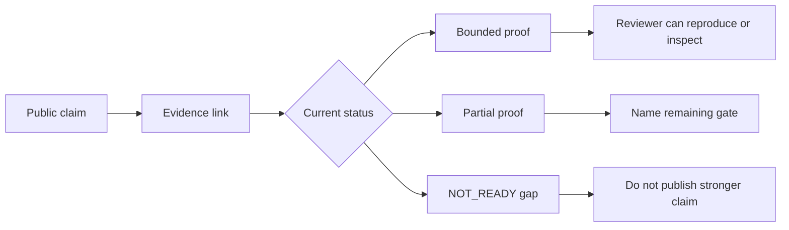
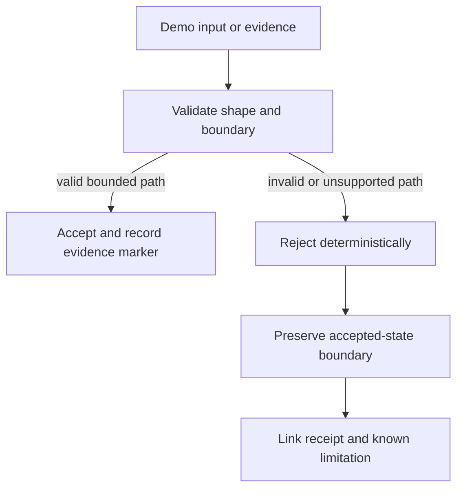
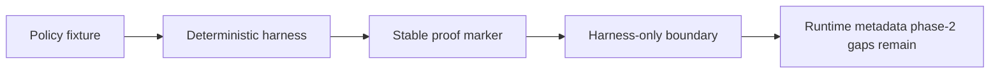
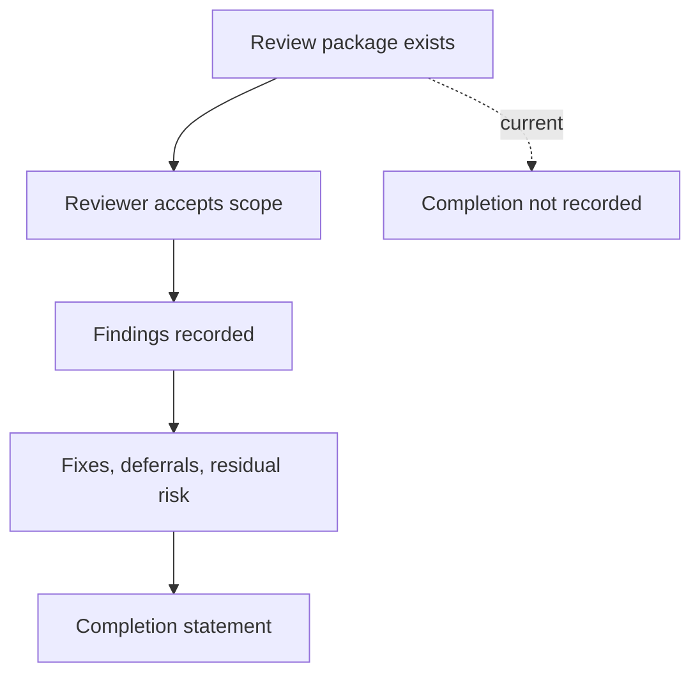

Goals: G1, G2, G3, G4, G5

Status: Supporting
Owner: QSL governance
Last-Updated: 2026-05-15
Replaces: n/a
Superseded-By: n/a

# NA-0295 Website Landing Page Handoff and Evidence Visuals Plan

## Executive Summary

NA-0295 turns the public evidence navigation from NA-0294 into a concrete
website landing page and evidence-visuals handoff plan. It is planning and
claim-boundary work only. It does not edit the live website, an external
website repository, website deployment settings, social channels, runtime
code, protocol behavior, service behavior, workflows, scripts, Cargo metadata,
dependencies, branch protection, or public-safety configuration.

The safest public narrative remains:

> Post-quantum messaging needs evidence, not slogans. QSL is building that
> evidence in public.

The handoff uses that narrative without making stronger claims than the current
evidence supports. It keeps these gaps visible: metadata phase-2 is incomplete,
external review is incomplete, qsl-server and qsl-attachments production gates
remain open, public internet service readiness is not proven, and website
implementation has not happened.

## Scope and Non-Goals

In scope:

- audit local public-navigation and website-handoff documents;
- record read-only website/source status where safely available;
- define landing page information architecture and section-level copy seeds;
- map every proposed section to evidence and a claim boundary;
- define evidence visuals and captions for future implementation;
- define safe, evidence-linked, prohibited, and replacement website language;
- provide future website implementation gates and stop conditions.

Out of scope:

- website or external website repository mutation;
- website deployment, DNS, hosting, form, social, or public posting work;
- image, video, or binary media generation;
- qsl-protocol runtime, protocol, wire, crypto, state-machine, demo, service,
  qsc-desktop, qsl-server, or qsl-attachments implementation changes;
- `.github/**`, `scripts/**`, `Cargo.toml`, `Cargo.lock`, dependency, branch
  protection, or public-safety configuration changes;
- stronger public claims for release, production operation, external review,
  anonymity, metadata elimination, untraceability, or absolute security.

## Sources Inspected

Local qsl-protocol sources inspected:

- [README.md](../../../README.md)
- [START_HERE.md](../../../START_HERE.md)
- [docs/public/INDEX.md](../../public/INDEX.md)
- [docs/public/PUBLIC_ATTENTION_AND_VISIBILITY_STRATEGY.md](../../public/PUBLIC_ATTENTION_AND_VISIBILITY_STRATEGY.md)
- [docs/public/WEBSITE_IMPLEMENTATION_HANDOFF.md](../../public/WEBSITE_IMPLEMENTATION_HANDOFF.md)
- [docs/public/WEBSITE_CLAIM_MATRIX.md](../../public/WEBSITE_CLAIM_MATRIX.md)
- [docs/public/WEBSITE_UPDATE_PLAN.md](../../public/WEBSITE_UPDATE_PLAN.md)
- [docs/public/RELEASE_READINESS_EVIDENCE_MAP.md](../../public/RELEASE_READINESS_EVIDENCE_MAP.md)
- [docs/public/EXTERNAL_REVIEW_PACKAGE.md](../../public/EXTERNAL_REVIEW_PACKAGE.md)
- [docs/governance/evidence/NA-0294_public_evidence_navigation_refresh_audit.md](NA-0294_public_evidence_navigation_refresh_audit.md)
- [docs/governance/evidence/NA-0290A_public_attention_visibility_audit.md](NA-0290A_public_attention_visibility_audit.md)
- [docs/governance/evidence/NA-0291_metadata_phase2_identifier_padding_harness.md](NA-0291_metadata_phase2_identifier_padding_harness.md)
- [docs/governance/evidence/NA-0293_metadata_phase2_sanitized_errors_retention_harness.md](NA-0293_metadata_phase2_sanitized_errors_retention_harness.md)
- [docs/governance/evidence/NA-0287_service_production_gate_evidence_map.md](NA-0287_service_production_gate_evidence_map.md)
- [TRACEABILITY.md](../../../TRACEABILITY.md)
- [DECISIONS.md](../../../DECISIONS.md)
- [NEXT_ACTIONS.md](../../../NEXT_ACTIONS.md)
- targeted read-only searches under [docs/demo](../../demo/) and
  [docs/design](../../design/).

Read-only public surfaces inspected:

- <https://quantumshieldlabs.dev/>
- <https://quantumshieldlabs.org/>
- <https://github.com/QuantumShieldLabs>
- <https://github.com/QuantumShieldLabs/qsl-protocol>

No forms, logins, dashboards, paid actions, social actions, settings changes,
branches, deployments, or website repositories were mutated.

## Website and Source Status

`quantumshieldlabs.dev` rendered public unauthenticated content. The page is a
broader company/product surface with healthcare PQC consulting, AI security
agent, API, live-project, risk-calculator, playbook, and SELARIX language. This
surface can attract attention, but it must not be used as proof that
qsl-protocol release gates are complete.

`quantumshieldlabs.org` resolved with a public QSL research title through the
web module, but no body text was available in the extracted view. NA-0295 does
not infer body content from the title.

The previously identified external website source repository is not a public
source target for this plan. NA-0295 does not inspect private website source
content and does not edit, clone for mutation, push, or deploy any website
repository. A future lane must verify the exact website source and branch
before authorizing implementation.

## Baseline Audit Result

| Audit category | Current status | Safe opportunity | Boundary risk |
| --- | --- | --- | --- |
| Website landing-page readiness | Local handoff docs exist; live-source implementation path is not verified. | Build a claim-safe plan before source edits. | Treating this handoff as a live website update. |
| Evidence visual readiness | Evidence maps, demo proof, service maps, and metadata harness docs exist. | Convert claim -> evidence -> gap into simple diagrams. | Visuals can imply completeness if gaps are hidden. |
| Hero message | The NA-0290A public hook is already approved for planning. | Use the hook with immediate research-stage boundary text. | Isolated hook can sound stronger than the evidence. |
| First-scroll explanation | README and docs/public now explain evidence first. | Adapt the public docs shape into a website-first section. | Website copy can overcompress limitations. |
| What is proven visual | Release map has current `PROVEN`, `PARTIAL`, `DOCS_ONLY`, `FUTURE_GATE`, and `NOT_READY` terms. | Show bounded proof categories with evidence links. | Do not turn `PARTIAL` evidence into release approval. |
| What is not proven visual | Public docs and review package list gaps. | Put gaps beside proof, not behind a footer. | Hiding gaps would weaken claim discipline. |
| Demo/evidence path | Demo docs cover local, KT-negative, attachment, cross-host, stress, and soak evidence. | Present demo as a reproducible evidence path. | Demo success must not imply deployment approval. |
| Reviewer path | External review package exists. | Ask reviewers for findings, missing vectors, ambiguity reports, and claim-boundary issues. | Package existence must not be represented as completed review. |
| Contributor/supporter path | CONTRIBUTING and SUPPORT exist; strategy proposes evidence tasks. | Invite negative tests, reproduction proof, docs links, and claim-boundary review. | Do not imply funding or support buys stronger claims. |
| Claim boundary clarity | Existing docs are conservative. | Reuse safe/prohibited language in website authoring. | Company product language can leak into qsl-protocol claims. |
| Website copy risk | `quantumshieldlabs.dev` includes live product/service language. | Add a QSL protocol status band and evidence route in future implementation. | Brand proximity can imply qsl-protocol production status. |
| Implementation dependencies | Exact public website source is not verified in this lane. | Promote source verification to NA-0296. | Editing the wrong repo or branch would be out of scope. |
| Evidence artifacts that could become visuals | Release map, traceability, demo receipts, service map, metadata harnesses, external review package. | Build diagrams from checked-in evidence. | Media must carry dates, links, and limitations. |
| Future-gated work | Website source verification, implementation, screenshots, videos, external review findings, production service gates. | Keep future gates explicit. | Do not pre-approve implementation. |
| Safe handoff now | A docs-only plan, testplan, D-0566, traceability, and handoff reference. | Prepare the future author without touching the website. | Keep NA-0295 as planning only. |

## Landing Page Information Architecture

Recommended website landing-page structure:

1. Hero: memorable evidence-first hook and immediate boundary note.
2. Why this matters: algorithm labels are not enough; behavior needs proof.
3. Evidence first: what is proven now, what remains open, and where to check.
4. Demo evidence: non-production demo story with stress, soak, and cross-host
   proof boundaries.
5. Service hardening: local qsl-server and qsl-attachments evidence with
   production gates.
6. Metadata honesty: metadata phase-2 harness proof and remaining gaps.
7. External review: package exists; review completion does not.
8. How to help: review evidence, run demos, propose tests, contribute docs.
9. Footer boundary: research-stage, not production, no anonymity or
   metadata-elimination claim, external review incomplete.

## Section-by-Section Copy Handoff

| Section | Proposed copy seed | Evidence link target | Claim-boundary note | Visual suggestion | Implementation notes | Risk |
| --- | --- | --- | --- | --- | --- | --- |
| Hero | "Post-quantum messaging needs evidence, not slogans. QSL is building that evidence in public." | [Public evidence landing page](../../public/INDEX.md) | Add boundary text in the first viewport: research-stage, not deployment approval. | Evidence receipt strip with claim, proof, gap. | Primary CTA: "Read the evidence map." Secondary CTA: "Try the non-production demo." | Medium |
| Hero boundary | "Research-stage and non-production. External review, metadata phase-2, service production gates, and public internet readiness remain open." | [Release-readiness evidence map](../../public/RELEASE_READINESS_EVIDENCE_MAP.md) | Must stay near the CTA, not only in the footer. | Small status badges: PARTIAL, NOT_READY, DOCS_ONLY. | Use sober labels, not celebratory badges. | High |
| Why this matters | "Post-quantum messaging needs more than algorithm labels. A credible system has to prove how negotiation fails closed, how replay and reject paths behave, what metadata remains visible, and what services are not yet ready." | [GOALS.md](../../../GOALS.md), [Traceability](../../../TRACEABILITY.md) | Motivation only; no threat-timeline countdown without current external sources. | Simple problem -> evidence -> gap flow. | Avoid unsupported countdown claims. | Medium |
| Evidence first | "Start with what can be checked: Suite-2 vectors, model checks, fail-closed rejects, demo receipts, service-boundary maps, and metadata policy harnesses." | [Release-readiness evidence map](../../public/RELEASE_READINESS_EVIDENCE_MAP.md) | Separate bounded proof from full release approval. | Proven / Not Proven matrix. | Each item links directly to evidence. | High |
| What is proven now | "Current evidence supports bounded properties across Suite-2, SCKA, downgrade resistance, selected KT and reject no-mutation paths, local demo behavior, service hardening maps, and metadata policy fixtures." | [External review package](../../public/EXTERNAL_REVIEW_PACKAGE.md) | Use "bounded" and link to current proof. | Receipt cards with source and command. | Do not use this as a complete release checklist. | High |
| What remains not proven | "Production readiness, public internet service readiness, external review completion, anonymity, metadata-free messaging, untraceability, runtime metadata phase-2 completion, and production service operation remain open." | [Release-readiness evidence map](../../public/RELEASE_READINESS_EVIDENCE_MAP.md) | Gaps must be visible next to proof. | Balanced split view with equal visual weight. | Do not bury this below unrelated company product sections. | High |
| Demo | "Try the demo as evidence, not deployment approval. It exercises bounded local positive and negative paths and records what it does not prove." | [Demo acceptance criteria](../../demo/DEMO_ACCEPTANCE_CRITERIA.md) | Always say non-production. | Demo timeline: init, establish, send, receive, reject, evidence. | Link cross-host/stress/soak docs as supporting proof. | Medium |
| Service hardening | "qsl-server and qsl-attachments have local hardening evidence and explicit production gates. That is not production service approval." | [Service production-gate evidence map](NA-0287_service_production_gate_evidence_map.md) | Do not conflate QuantumShield API, qsl-server, or qsl-attachments. | Service boundary map. | Keep service cards separate from external product cards. | High |
| Metadata honesty | "Metadata minimization work is evidence-bound and incomplete. Current phase-2 proof is bounded to deterministic policy fixtures, not runtime anonymity." | [NA-0291](NA-0291_metadata_phase2_identifier_padding_harness.md), [NA-0293](NA-0293_metadata_phase2_sanitized_errors_retention_harness.md) | No anonymity, metadata-free, or untraceable wording. | Fixture proof diagram. | Show residual metadata categories. | High |
| External review | "The external review package is ready for reviewers to inspect. Review completion, findings, disposition, and residual-risk signoff are not recorded yet." | [External review package](../../public/EXTERNAL_REVIEW_PACKAGE.md) | Package exists does not mean review complete. | Review readiness ladder. | Ask for findings, missing vectors, ambiguity reports. | High |
| How to help | "Review a claim, run a bounded demo, propose missing negative tests, improve evidence links, or clarify a NOT_READY boundary." | [CONTRIBUTING.md](../../../CONTRIBUTING.md), [SUPPORT.md](../../../SUPPORT.md) | Avoid implying support changes evidence status. | Contributor path diagram. | Keep tasks concrete and evidence-strengthening. | Low |
| Footer | "QSL is research-stage. Public evidence is in progress. This website section is a route to proof and gaps, not a release approval." | [docs/public/INDEX.md](../../public/INDEX.md) | Repeat the major no-claim boundaries. | Compact claim boundary checklist. | Keep footer language consistent with hero boundary. | Medium |

## Evidence Links for Each Section

Required future landing-page evidence links:

- Hero and public overview: [docs/public/INDEX.md](../../public/INDEX.md)
- Release posture: [docs/public/RELEASE_READINESS_EVIDENCE_MAP.md](../../public/RELEASE_READINESS_EVIDENCE_MAP.md)
- External review route: [docs/public/EXTERNAL_REVIEW_PACKAGE.md](../../public/EXTERNAL_REVIEW_PACKAGE.md)
- Demo route: [docs/demo/DEMO_ACCEPTANCE_CRITERIA.md](../../demo/DEMO_ACCEPTANCE_CRITERIA.md)
- Cross-host demo stress: [docs/demo/CROSS_HOST_DEMO_STRESS_REPRODUCIBILITY.md](../../demo/CROSS_HOST_DEMO_STRESS_REPRODUCIBILITY.md)
- Demo soak: [docs/demo/DEMO_SOAK_REPEATED_RUN_STABILITY.md](../../demo/DEMO_SOAK_REPEATED_RUN_STABILITY.md)
- Service production gates: [NA-0287 service map](NA-0287_service_production_gate_evidence_map.md)
- Metadata identifier/padding proof: [NA-0291 harness](NA-0291_metadata_phase2_identifier_padding_harness.md)
- Metadata sanitized-error/retention proof: [NA-0293 harness](NA-0293_metadata_phase2_sanitized_errors_retention_harness.md)
- Website claim risks: [docs/public/WEBSITE_CLAIM_MATRIX.md](../../public/WEBSITE_CLAIM_MATRIX.md)
- Prior website handoff: [docs/public/WEBSITE_IMPLEMENTATION_HANDOFF.md](../../public/WEBSITE_IMPLEMENTATION_HANDOFF.md)
- Public attention strategy: [docs/public/PUBLIC_ATTENTION_AND_VISIBILITY_STRATEGY.md](../../public/PUBLIC_ATTENTION_AND_VISIBILITY_STRATEGY.md)
- Traceability: [TRACEABILITY.md](../../../TRACEABILITY.md)
- Decisions: [DECISIONS.md](../../../DECISIONS.md)

## CTA Hierarchy

Primary CTA:

- "Read the evidence map" -> [Release-readiness evidence map](../../public/RELEASE_READINESS_EVIDENCE_MAP.md)

Secondary CTA:

- "Try the non-production demo" -> [Demo acceptance criteria](../../demo/DEMO_ACCEPTANCE_CRITERIA.md)

Tertiary links:

- "Review the package" -> [External review package](../../public/EXTERNAL_REVIEW_PACKAGE.md)
- "Help strengthen the evidence" -> [CONTRIBUTING.md](../../../CONTRIBUTING.md)

CTA boundary note:

- "Research-stage. Not deployment approval. Review completion and metadata
  phase-2 remain open."

## Evidence Visuals Plan

| Visual | Objective | Audience | Source evidence | Required data | Suggested format | Safe caption | Prohibited caption | Difficulty | Evidence gate before publishing | Repo-docs first? |
| --- | --- | --- | --- | --- | --- | --- | --- | --- | --- | --- |
| Evidence receipts map | Show claim -> evidence -> current gap. | Reviewers, writers, developers. | Release map, external review package, traceability. | Claim text, evidence link, status, gap. | Mermaid now; SVG later. | "Follow each claim to current proof and open gaps." | "All claims are proven." | Medium | Link check and claim-boundary scan. | Yes |
| Proven / Not Proven matrix | Put proof and limits side by side. | Broad technical public. | Release map, public docs index. | Status categories and gap list. | One-page graphic. | "Bounded proof and visible NOT_READY gates." | "Ready for production." | Low | Review every row against release map. | Yes |
| Fail-closed demo flow | Explain reject/no-mutation posture. | Developers, testers. | Demo criteria, NA-0241, NA-0259, NA-0260. | Flow steps, reject markers, evidence links. | Mermaid diagram; short video later. | "Selected rejects fail closed on bounded demo and vector surfaces." | "Every possible reject is proven." | Medium | Verify marker names and commands. | Yes |
| Metadata phase-2 fixture proof diagram | Show policy fixture scope and remaining runtime gaps. | Privacy/security reviewers. | NA-0291, NA-0293, release map. | Fixture categories, markers, runtime gaps. | Mermaid diagram. | "Policy fixtures prove bounded metadata behavior; runtime gaps remain." | "Metadata-free or anonymous." | Medium | Check against NA-0291/NA-0293 boundaries. | Yes |
| Service hardening map | Separate qsl-protocol, qsl-server, qsl-attachments, external products. | Operators, public readers. | NA-0287, website claim matrix. | Surface names, evidence class, future gates. | SVG later; Mermaid now. | "Local service hardening evidence with production gates." | "Public internet service ready." | Medium | Verify no service deployment claim. | Yes |
| External review readiness ladder | Show package -> scope -> findings -> disposition -> completion. | Reviewers, supporters. | External review package. | Review stages and current status. | One-page graphic. | "Package exists; review completion is not recorded." | "Externally reviewed." | Low | Confirm no findings/completion are present. | Yes |
| Demo timeline / build journal timeline | Show evidence accumulation without release hype. | Contributors, supporters. | Demo docs, traceability, decisions. | Date, NA/PR, evidence type, boundary. | Timeline graphic. | "Evidence accumulated by lane; release gates remain." | "Launch-ready timeline." | Medium | Use short SHAs only and date-stamped evidence. | Yes |
| Security claims with receipts infographic | Make the public hook shareable. | Writers, social, reviewers. | Release map, external package. | Claim, receipt, caveat, link. | One-page graphic. | "Security claims with receipts and caveats." | "Guaranteed secure." | Medium | Prohibited-phrase scan. | Yes |
| Reviewer path diagram | Show how a reviewer should inspect and report. | External reviewers. | External review package, release map. | Start docs, outputs, gaps. | Mermaid diagram. | "Review starts from claims and records findings." | "Review complete." | Low | Check package status. | Yes |
| Contributor path diagram | Make evidence-strengthening tasks concrete. | Contributors. | Public docs index, CONTRIBUTING, SUPPORT. | Task categories and allowed outputs. | Mermaid diagram. | "Small contributions can strengthen proof quality." | "Feature work first." | Low | Confirm tasks are docs/tests/repro evidence. | Yes |

### Evidence Receipts Map Sketch

### Fail-Closed Demo Flow Sketch

### Metadata Fixture Scope Sketch

### External Review Ladder Sketch

## Claim Matrix

### Safe Claims

| Safe claim | Required qualifier | Evidence |
| --- | --- | --- |
| QSL is research-stage and evidence-driven. | Say non-production. | [README.md](../../../README.md), [docs/public/INDEX.md](../../public/INDEX.md) |
| QSL publishes evidence, limitations, and gaps. | Link proof and gap sources. | [Release-readiness evidence map](../../public/RELEASE_READINESS_EVIDENCE_MAP.md) |
| Selected fail-closed behavior has tests, vectors, or model evidence. | Say selected and bounded. | [TRACEABILITY.md](../../../TRACEABILITY.md), [External review package](../../public/EXTERNAL_REVIEW_PACKAGE.md) |
| The demo is a non-production evidence surface. | Do not say deployment proof. | [Demo acceptance criteria](../../demo/DEMO_ACCEPTANCE_CRITERIA.md) |
| qsl-server and qsl-attachments have local hardening evidence. | Say production gates remain open. | [NA-0287 service map](NA-0287_service_production_gate_evidence_map.md) |
| Metadata phase-2 has bounded policy-harness proof. | Say runtime completion is not proven. | [NA-0291](NA-0291_metadata_phase2_identifier_padding_harness.md), [NA-0293](NA-0293_metadata_phase2_sanitized_errors_retention_harness.md) |
| The external review package is available for review. | Say review completion is not recorded. | [External review package](../../public/EXTERNAL_REVIEW_PACKAGE.md) |

### Claims Requiring Evidence Links

| Claim shape | Required evidence link | Required boundary |
| --- | --- | --- |
| Suite-2 / Triple-Ratchet-style design | [Suite-2 claim boundary](../../public/SUITE2_TRIPLE_RATCHET_CLAIM_BOUNDARY.md) | Research-stage, release-gated, not equivalent to production Signal. |
| Always-hybrid per-message design | [GOALS.md](../../../GOALS.md), [TRACEABILITY.md](../../../TRACEABILITY.md) | Architecture/evidence claim for covered paths, not production assurance. |
| Downgrade resistance | [Release map](../../public/RELEASE_READINESS_EVIDENCE_MAP.md) | Covered vectors/model/tests only. |
| Metadata minimization | [Release map](../../public/RELEASE_READINESS_EVIDENCE_MAP.md) | Residual metadata remains visible. |
| Demo reproducibility | [Demo criteria](../../demo/DEMO_ACCEPTANCE_CRITERIA.md) | Non-production and bounded. |
| Service hardening | [NA-0287 service map](NA-0287_service_production_gate_evidence_map.md) | Local hardening only; production gates open. |

### Prohibited Claims and Replacement Language

| Prohibited claim | Replacement language |
| --- | --- |
| "production-ready protocol" | "research-stage protocol with public evidence and open release gates" |
| "ready for production users" | "not production; available for review and reproduction" |
| "public internet ready" | "public internet readiness remains future-gated" |
| "external review complete" or "externally reviewed" | "prepared for external review; findings and completion are not recorded yet" |
| "anonymous messaging" | "metadata minimization work is in progress; residual metadata remains" |
| "metadata-free" | "metadata phase-2 has bounded policy-fixture proof; runtime metadata gaps remain" |
| "untraceable" | "not an untraceability claim; review the residual metadata map" |
| "quantum-proof" | "post-quantum-first research-stage design with evidence-linked claims" |
| "unbreakable" or "guaranteed secure" | "bounded claims tied to tests, vectors, models, and reviewable assumptions" |
| "proven true Triple Ratchet" | "research-stage Suite-2 / Triple-Ratchet-style design" |
| "website updated" | "website handoff plan prepared; implementation remains future work" |
| "live website updated" | "no live website mutation occurred in NA-0295" |
| "launch ready" | "future implementation requires source verification, link checks, and claim-boundary scans" |

## Website Copy Boundaries

Hero:

- Safe: "Post-quantum messaging needs evidence, not slogans."
- Required boundary: research-stage, non-production, evidence map first.
- Unsafe: any hero that implies completed review, production operation, or
  absolute security.

Service:

- Safe: "Local service hardening evidence exists, with production gates still
  open."
- Required boundary: do not conflate QuantumShield API, qsl-server, or
  qsl-attachments.
- Unsafe: public internet or production relay/attachment approval.

Metadata:

- Safe: "Metadata minimization is evidence-bound and incomplete."
- Required boundary: residual metadata remains; phase-2 runtime work is open.
- Unsafe: anonymity, metadata-free, untraceable, or traffic-analysis resistance
  claims.

External review:

- Safe: "Review package exists and is ready for inspection."
- Required boundary: findings, disposition, and completion are not recorded.
- Unsafe: externally reviewed, certified, or review-complete language.

Demo:

- Safe: "Non-production demo evidence proves selected positive and negative
  paths."
- Required boundary: demo proof is not deployment approval.
- Unsafe: demo-as-production, production authentication UX, or service
  deployment proof.

## Implementation Handoff

Future website implementation should edit only the verified website source repo
and only after source, branch, and deployment ownership are proven. The likely
implementation surfaces are:

- landing page content/components for the QSL protocol status band;
- evidence section or page;
- product/service taxonomy labels separating external products from
  qsl-protocol evidence;
- claim-boundary copy for Suite-2, demo, metadata, services, and external
  review;
- visual assets generated from this plan after link and claim review;
- tests or scripts in the website repo for link checks and prohibited phrase
  scans.

Required future links:

- qsl-protocol public repo;
- [docs/public/INDEX.md](../../public/INDEX.md);
- [docs/public/RELEASE_READINESS_EVIDENCE_MAP.md](../../public/RELEASE_READINESS_EVIDENCE_MAP.md);
- [docs/public/EXTERNAL_REVIEW_PACKAGE.md](../../public/EXTERNAL_REVIEW_PACKAGE.md);
- [docs/demo/DEMO_ACCEPTANCE_CRITERIA.md](../../demo/DEMO_ACCEPTANCE_CRITERIA.md);
- [NA-0287 service map](NA-0287_service_production_gate_evidence_map.md);
- [NA-0291 metadata harness](NA-0291_metadata_phase2_identifier_padding_harness.md);
- [NA-0293 metadata harness](NA-0293_metadata_phase2_sanitized_errors_retention_harness.md);
- [docs/public/WEBSITE_CLAIM_MATRIX.md](../../public/WEBSITE_CLAIM_MATRIX.md);
- [docs/public/WEBSITE_IMPLEMENTATION_HANDOFF.md](../../public/WEBSITE_IMPLEMENTATION_HANDOFF.md).

Required visible `NOT_READY` boundaries:

- production readiness;
- public internet service readiness;
- external review completion;
- anonymity, metadata-free messaging, and untraceability;
- runtime identifier rotation and runtime default padding;
- broader runtime sanitized-error coverage;
- production retention/deletion behavior;
- production qsl-server and qsl-attachments operation;
- website implementation status until the website PR actually merges and
  deploys.

## Future Website Implementation Stop Conditions

Stop a future website implementation lane if any of these occur:

- exact website source repository, branch, or deployment path is not verified;
- live copy has changed enough that the claim matrix is stale;
- implementation would edit qsl-protocol without separate authorization;
- implementation would touch protocol, crypto, service, demo, workflow, script,
  Cargo, dependency, branch-protection, or public-safety paths;
- any proposed copy implies production readiness, public internet readiness,
  external review completion, anonymity, metadata-free messaging,
  untraceability, quantum-proof status, unbreakable security, or guaranteed
  security;
- evidence links are broken or point to non-authoritative pages;
- external product claims are used as qsl-protocol evidence;
- media captions hide current `NOT_READY` boundaries;
- link/leak/overclaim checks cannot run or conclusively fail.

## Validation Plan for Future Implementation

Minimum future website validation:

- scope proof showing only website repository files changed;
- source branch and deployment-target proof;
- static overclaim phrase scan;
- link check for every evidence URL;
- accessibility checks for heading order, link names, color contrast, keyboard
  focus, and alt text;
- screenshot review of desktop and mobile first viewport, evidence section,
  `NOT_READY` boundaries, service separation, metadata copy, external review
  copy, and visual captions;
- no form submission or public posting during validation;
- rollback plan identifying the website commit or deployment to revert.

## Recommended Future Website Directive

Title:

- NA-0296 - Website Source Verification and Claim-Safe Implementation
  Readiness Audit

Exact scope:

- qsl-protocol docs/governance evidence and testplan for source verification;
- optional reference update to this handoff if live scope allows;
- no website or external website mutation.

Allowed paths:

- `docs/governance/evidence/NA-0296_website_source_verification_readiness_audit.md`
- `tests/NA-0296_website_source_verification_readiness_testplan.md`
- `docs/public/WEBSITE_IMPLEMENTATION_HANDOFF.md` if live scope allows
- `DECISIONS.md`
- `TRACEABILITY.md`
- `docs/ops/ROLLING_OPERATIONS_JOURNAL.md` only if consistent

Forbidden paths:

- website repositories and deployment settings;
- qsl-protocol implementation paths;
- `.github/**`, `scripts/**`, Cargo files, dependencies, branch protection,
  and public-safety configuration.

Validation commands:

- queue and decision helpers;
- scope guard with exact allowed paths;
- link-check;
- added-line leak scan;
- overclaim phrase scan;
- dependency/advisory health checks required by the active directive;
- goal-lint and classifier proof for the changed path set.

Acceptance criteria:

- exact website source and implementation path are verified or explicitly
  marked not verified;
- future implementation prerequisites and stop conditions are updated;
- no website mutation occurs;
- required CI is green.

## What Is Not Implemented in NA-0295

NA-0295 does not implement:

- live website copy;
- website repository code;
- website deployment;
- DNS, hosting, forms, analytics, or social posting;
- generated images, videos, screenshots, or media assets;
- protocol, crypto, service, runtime, demo, qsc-desktop, qsl-server, or
  qsl-attachments behavior;
- release approval, production service approval, external review completion,
  or metadata phase-2 completion.

## Future NA Recommendation

Promote NA-0296 only after NA-0295 merges and public-safety remains green:

- NA-0296 should verify the exact website source, branch, build/deployment
  path, public website surfaces, and claim-boundary implementation readiness.
- NA-0296 should remain read-only with respect to the website and external
  website repo.
- A later implementation NA should be separate, limited to the verified website
  source, and should carry screenshots, link checks, overclaim scans, and
  rollback proof.

## No-Mutation Proof

This plan is a qsl-protocol docs/governance artifact. It records website and
visual handoff guidance without modifying:

- the live website;
- any external website source repository;
- website deployment configuration;
- public social or outreach surfaces;
- qsl-protocol runtime, protocol, crypto, demo, service, desktop, workflow,
  script, Cargo, dependency, branch-protection, or public-safety paths.
